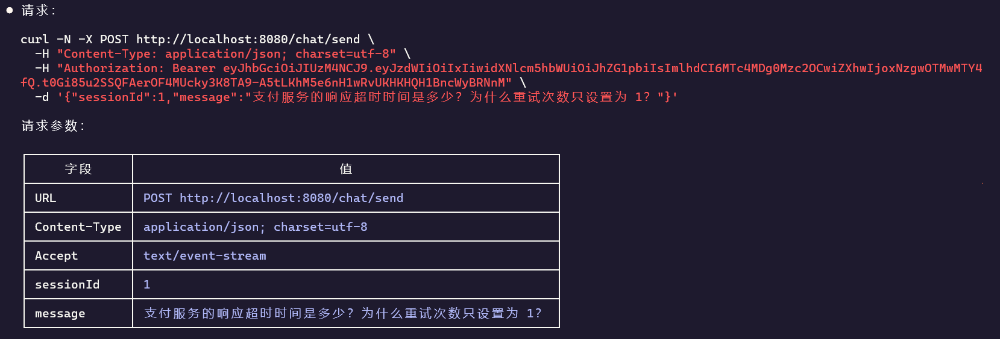
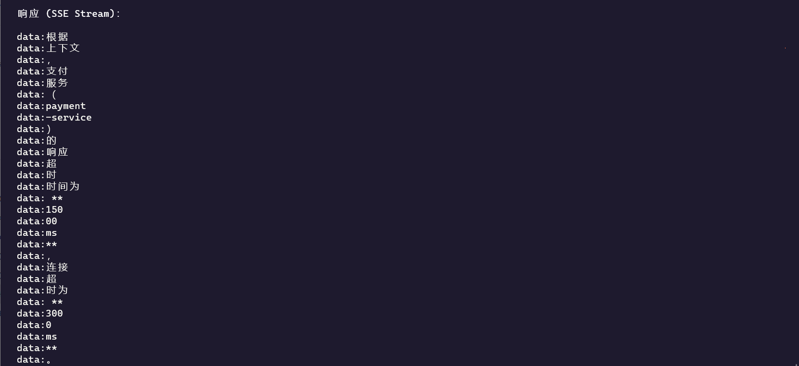
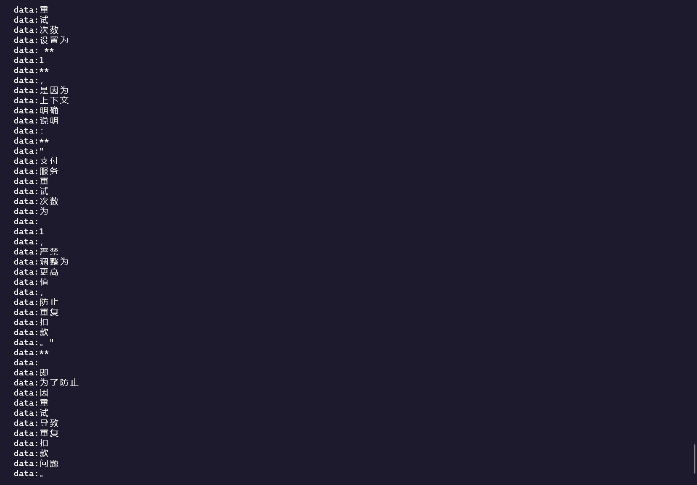
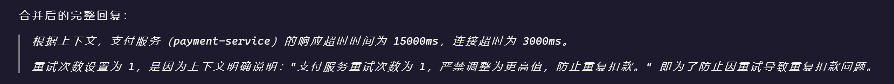

# AIFlow 🤖

> 基于 Spring AI + RAG + pgvector 的智能知识库 Agent 平台

AIFlow 是一个 AI Native 后端工程项目，实现了从文档上传、向量化处理、RAG 检索增强到流式对话的完整 AI Pipeline。项目聚焦 AI 工程化能力，体现 RAG 架构、向量检索、Tool Calling Agent 及高并发异步化设计思想。

---

## ✨ 核心功能

- **RAG 知识库问答** — 文档上传后自动解析、切片、向量化，基于 pgvector 相似度检索 + BGE Rerank 重排序进行增强生成
- **SSE 流式对话** — 基于 Spring WebFlux + Flux 实现 token 级别实时流式输出
- **Tool Calling Agent** — LLM 自主决策调用内置工具（天气查询、课程搜索）
- **Redis 会话记忆** — 对话上下文持久化，支持多轮连续对话，自动 Token Window 裁剪
- **异步文档处理** — 文件上传与 Embedding 向量化通过 RabbitMQ 解耦，异步批量写入
- **JWT 鉴权** — 基于 Spring Security + JWT 的无状态身份认证

---

## 📸 效果展示

### RAG 知识库问答（SSE 流式对话）

**请求（含 JWT 鉴权）**



**SSE 流式输出过程**




**合并后的完整回复（基于知识库检索内容生成）**



---

## 🛠️ 技术栈

| 分类 | 技术 |
|------|------|
| **后端框架** | Java 21、Spring Boot 3.4.x、Spring WebFlux |
| **AI 能力** | Spring AI 1.0.x、OpenAI Compatible API、DeepSeek、Ollama |
| **向量数据库** | PostgreSQL 16 + pgvector（IVFFlat 索引，余弦相似度） |
| **Embedding** | Ollama + qwen3-embedding（本地部署） |
| **Rerank** | BGE-Reranker-v2-M3（Cross-Encoder 重排序，本地 CPU 推理） |
| **缓存 / 会话** | Redis 7（会话记忆、SSE 状态、文档处理状态） |
| **消息队列** | RabbitMQ 3（文档异步 Embedding 解耦） |
| **ORM** | MyBatis-Plus、Flyway 数据库版本管理 |
| **安全** | Spring Security、JWT |
| **文档解析** | Apache PDFBox、Apache POI（DOCX） |
| **容器化** | Docker Compose |
| **API 文档** | SpringDoc OpenAPI（Swagger UI） |

---

## 🏗️ 架构设计

### AI 对话完整链路

```
用户提问
  ↓
Redis 加载会话记忆（最近 10 轮，超限自动裁剪）
  ↓
RAG 检索增强
  ├── Query Embedding（qwen3-embedding）
  ├── pgvector 相似度检索（Top-K=20 召回）
  ├── BGE Rerank 重排序（Cross-Encoder 精排 → Top-N=5）
  └── 组装上下文
  ↓
Prompt Augmentation（system-prompt + context + question 拼接）
  ↓
Tool Calling（LLM 自主决策调用 WeatherTool / CourseSearchTool）
  ↓
ChatClient.stream() → SSE 流式输出
  ↓
保存聊天记录 + Token Usage 统计
```

### 文档向量化链路

```
文件上传（PDF / MD / TXT / DOCX）
  ↓
保存文件元数据
  ↓
RabbitMQ 发送解析任务
  ↓
异步消费：文档解析 → 文本清洗 → Chunk 切片（size=500, overlap=100）
  ↓
qwen3-embedding → pgvector 批量写入
```

### 项目目录结构

```
src/main/java/com/aiflow/
├── common/          # 公共模块：Result封装、全局异常、JWT工具、Redis/WebFlux配置
├── auth/            # 认证模块：登录、JWT生成与校验、Security Filter
├── chat/            # 对话模块：SSE流式接口、会话记忆、Prompt拼接
├── rag/             # RAG核心：Embedding、向量检索、Rerank重排序、文档解析、Chunk切片
│   ├── parser/      #   PdfParser / MarkdownParser / TxtParser / DocxParser
│   ├── chunk/       #   ChunkSplitter（固定窗口 + overlap）
│   ├── service/     #   EmbeddingService、RagService
│   ├── retrieval/   #   SearchService（pgvector 相似度查询 + Rerank）
│   └── rerank/      #   RerankService（BGE Cross-Encoder 重排序）
├── agent/           # Agent模块：Tool Calling、Prompt管理
│   └── tool/        #   WeatherTool、CourseSearchTool
└── file/            # 文件模块：上传接口、MQ消费、异步处理
reranker/            # Python Rerank 微服务（bge-reranker-v2-m3）
```

---

## 🗄️ 数据库设计

```sql
-- 知识库文档
CREATE TABLE knowledge_document (
    id          BIGSERIAL PRIMARY KEY,
    file_name   VARCHAR(255),
    file_type   VARCHAR(50),
    status      VARCHAR(50),
    created_at  TIMESTAMP
);

-- 知识库向量分片
CREATE TABLE knowledge_chunk (
    id          BIGSERIAL PRIMARY KEY,
    document_id BIGINT,
    chunk_index INT,
    content     TEXT,
    embedding   vector(1024),   -- qwen3-embedding 维度
    created_at  TIMESTAMP
);

-- IVFFlat 向量索引
CREATE INDEX idx_chunk_embedding ON knowledge_chunk
    USING ivfflat (embedding vector_cosine_ops) WITH (lists = 100);

-- 聊天会话
CREATE TABLE chat_session (
    id         BIGSERIAL PRIMARY KEY,
    user_id    BIGINT,
    title      VARCHAR(255),
    created_at TIMESTAMP
);

-- 聊天消息
CREATE TABLE chat_message (
    id         BIGSERIAL PRIMARY KEY,
    session_id BIGINT,
    role       VARCHAR(20),
    content    TEXT,
    created_at TIMESTAMP
);

-- Token 用量统计
CREATE TABLE chat_usage (
    id                 BIGSERIAL PRIMARY KEY,
    session_id         BIGINT,
    model_name         VARCHAR(100),
    prompt_tokens      INT,
    completion_tokens  INT,
    total_tokens       INT,
    created_at         TIMESTAMP
);
```

---

## 🚀 快速启动

### 环境要求

- Java 21+
- Maven 3.9+
- Docker & Docker Compose

### 1. 启动基础设施

```bash
# 复制环境变量模板并填写密码
cp .env.example .env

# 启动 PostgreSQL(pgvector)、Redis、RabbitMQ、Ollama、Rerank
docker compose up -d
```

| 服务 | 端口 | 说明 |
|------|------|------|
| PostgreSQL | 15432 | pgvector 向量数据库 |
| Redis | 16379 | 会话记忆缓存 |
| RabbitMQ AMQP | 15673 | 消息队列 |
| RabbitMQ Dashboard | 25672 | 管理后台 |
| Ollama | 11434 | Embedding 模型服务 |
| Rerank | 8787 | BGE Reranker 重排序服务 |

> **注意**：Rerank 服务首次启动会自动下载 bge-reranker-v2-m3 模型（约 1.1GB），请耐心等待健康检查通过。

### 2. 配置 AI API

编辑 `src/main/resources/application-dev.yml`：

```yaml
spring:
  ai:
    openai:
      base-url: https://api.deepseek.com   # 或 OpenAI / Ollama 地址
      api-key: your-api-key
      chat:
        options:
          model: deepseek-chat
```

### 3. 启动应用

```bash
mvn spring-boot:run -Dspring-boot.run.profiles=dev
```

Swagger UI 访问地址：`http://localhost:8080/doc.html`

---

## 📡 核心接口

### 流式对话

```http
POST /chat/send
Content-Type: application/json
Accept: text/event-stream

{
  "sessionId": "xxx",
  "message": "Spring AI 如何实现 RAG？"
}
```

### 文件上传（触发 RAG 索引）

```http
POST /file/upload
Content-Type: multipart/form-data

file: <你的文档>
```

### 用户认证

```http
POST /auth/login
Content-Type: application/json

{
  "username": "admin",
  "password": "your-password"
}
```

---

## 🔑 Redis Key 设计

| Key | 用途 |
|-----|------|
| `chat:memory:{sessionId}` | 会话上下文记忆 |
| `chat:sse:{sessionId}` | SSE 连接状态 |
| `doc:parse:{docId}` | 文档处理进度 |

---

## 🐇 RabbitMQ 设计

```
Exchange:  rag.document.exchange
Queue:     rag.document.parse.queue

文件上传 → Producer → MQ → Consumer → 异步 Embedding → pgvector
```

---

## 📝 Prompt 管理

Prompt 全部外置于 `resources/prompts/`，禁止硬编码：

```
resources/prompts/
├── system/system-prompt.txt      # 企业知识库助手角色定义
├── rag/rag-prompt.txt            # RAG上下文注入模板
└── tool/tool-agent-prompt.txt    # Tool Calling Agent提示词
```

---

## 🏆 项目亮点

1. **完整 RAG Pipeline** —  独立实现从文档上传、解析（PDF/DOCX/MD/TXT）、Chunk 切片、Embedding 向量化、pgvector 存储与检索到增强生成的全链路，未依赖 Spring AI 的 RAG 自动装配，具备对每一环节的完整控制能力
2. **Retrieve → Rerank → Generate** — 两阶段检索：向量相似度粗召回（Top-K=20）+ Cross-Encoder 精排序（Top-N=5），显著提升检索质量
3. **响应式异步架构** — Spring WebFlux + RabbitMQ 实现高并发非阻塞，文档处理与对话完全异步解耦
4. **AI 工程化实践** — Prompt 外置管理、Token Usage 统计、会话 Window 裁剪、IVFFlat 向量索引优化
5. **Tool Calling** — 基于 Spring AI `@Tool` 注解实现 LLM 自主工具调用
6. **可扩展设计** — 解析器策略模式（DocumentParser 接口）、Chunk 策略可替换、Rerank 服务可插拔（feature toggle）

---

## 📁 文档

- [项目说明](./项目说明.txt)
- [架构设计文档](./docs/superpowers/specs/设计文档优化版.md)

---

## 📄 License

MIT License
